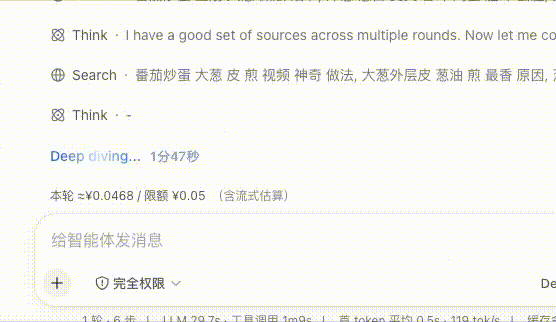
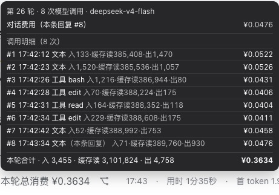
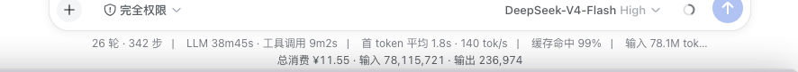
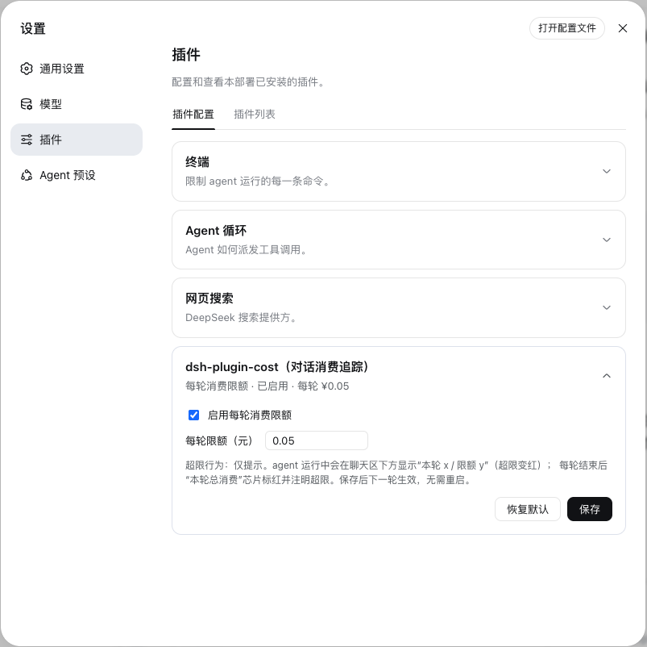

<p align="center">
  
</p>

# dsh-plugin-cost

> 给 DeepSeek Harness 的聊天界面装一个「账单显示器」——**每条回复花了多少钱、整场对话花了多少钱、有没有超预算**，全部实时显示，不用再自己去查用量。插件设置里开启限额提示后，对话进行时会动态估算当前已经产生的消费。

## 🎬 效果演示

<table>
  <tr>
    <td align="center">
      <br>
      <sub>① 对话进行中：本轮费用 <b>实时上涨</b>，接近限额变红提醒</sub>
    </td>
    <td align="center">
      <br>
      <sub>② 回复完成：消息旁显示 <b>本轮总消费</b>，悬停查看每次调用的明细</sub>
    </td>
  </tr>
  <tr>
    <td align="center">
      <br>
      <sub>③ 输入框下方常驻：<b>整场会话总消费</b>与输入/输出 token</sub>
    </td>
    <td align="center">
      <br>
      <sub>④ 设置页插件卡片：开关预算提醒、调整每轮限额</sub>
    </td>
  </tr>
</table>

## ✨ 它能做什么

- **每条回复一个价签**（见图②）：消息旁多出 `本轮总消费 ¥0.0987`，悬停可见这条回复本身多少钱、中间的每次调用（思考、查文件、跑命令…）各花了多少；
- **整场对话心里有数**（见图③）：输入框下方常驻 `总消费 ¥X · 输入 N · 输出 M`，随时瞄一眼；
- **预算提醒，防止跑冒**（见图①④）：给每轮设个上限（如 ¥1），对话中在输入框上方实时显示 `本轮 ¥0.34 / 限额 ¥1.00`，快超时变红；超了的那轮价签也标红；（目前仅作提示，如果消费超出心里预期，请主动停止当前对话）
- **自动按官方分时价计费**：DeepSeek 高峰时段（工作日北京时间 9:00–12:00、14:00–18:00）价格翻倍、其余半价，插件按每条回复的发生时刻自动判断；
- **价格自己说了算**：所有单价在配置文件里，官网调价后改几个数字即可，不用等插件更新。

> 金额为实时估算，以 token 用量 × 单价计算，单轮/单会话误差很小；最终以 DeepSeek 官方账单为准。

## 🚀 安装（三步）

```sh
# 1. 安装（在 dsh 源码目录下用 pnpm dsh，npm 安装版直接 dsh）
pnpm dsh plugin --profile web add dsh-plugin-cost

# 2. 重启 dsh web 生效
pnpm dsh web
```

3. 打开聊天页随便聊一句 → 消息旁边和输入框下方就会显示费用。

> 想先试 Git 版也可以：`pnpm dsh plugin --profile web add github:gaishilaji/dsh-plugin-cost`（首次安装会要求给该仓库的构建脚本授权，按提示操作）。

## 🤔 常见问题

**Q：显示的价格准吗？**
按官方价目表实时计算，展示的就是精确的 token 用量 × 单价（分时价自动处理）。极端情况下与实际账单可能有几分钱级舍入差异，以 DeepSeek 官方账单为准。开启限额后的流式估算会有一定误差，因为那个时候拿不到具体token消费，只能根据字符估算token，同样的在单轮次其误差忽略不计。

**Q：价格变了怎么办？**
不用等插件更新——打开 dsh 的配置（`cordis.patch.yml`），找到 `config.prices` 改数字即可，改完生效。

**Q：支持哪些模型？**
目前内置 DeepSeek 各模型的价格表（见下）。其他模型会照常统计 token 用量，费用暂记 0，在价格表里补一行就能计费。

---

# 开发者文档

## 定价与计费口径

按 [DeepSeek 官方《模型 & 价格》](https://api-docs.deepseek.com/zh-cn/quick_start/pricing/)（2026-08 快照）计价，单价单位为**元 / 百万 tokens**，配置存高峰价、空闲自动 ×0.5：

```
费用 = 未命中输入 × miss单价 + 缓存命中输入 × hit单价 + 输出 × 输出单价
```

| 模型 | 输入·缓存命中 | 输入·缓存未命中 | 输出 |
|---|---|---|---|
| deepseek-v4-flash / v4-flash-vision-exp | ¥0.10 | ¥3.00 | ¥9.00 |
| deepseek-v4-pro | ¥0.30 | ¥9.00 | ¥27.00 |

每条消息按其**发生时刻**判断峰谷（可重放、幂等）；同一消息重放不重复计费。

## 配置项

| 字段 | 默认 | 说明 |
|---|---|---|
| `prices` | 上表 | `{ [model]: { cacheHit, cacheMiss, output } }`，高峰价（元/百万） |
| `peakMode` | `auto` | `auto` 按北京时间分时；`peak` 恒高峰；`off-peak` 恒空闲 |
| `defaultModel` | `deepseek-v4-flash` | 读不到模型名时的兜底 |
| `budget.enabled` | `false` | 是否启用每轮消费限额（也可在 Web 设置卡改） |
| `budget.perTurn` | `1` | 每轮消费上限（元） |
| `budget.mode` | `'warn'` | 超限行为：`'warn'` 仅提示（`'ask'` 预留，未实现） |

限额可双通道配置：`cordis.patch.yml` 的 `config.budget`（部署默认层）或 Web 设置页
Plugins → 本插件设置卡（用户层，写入 `settings.yaml` 后覆盖默认，保存即生效）。

## 项目结构

```
dsh-plugin-cost/
├── package.json          # dsh.bundle + dsh.client；peer/dev 依赖；scripts
├── tsdown.config.ts      # 宿主 ESM 库 + 浏览器 CJS bundle 两段构建
├── cordis.patch.yml      # bundle 配置层（价格表、峰谷、限额在此配置）
├── dev/cordis.yml        # 开发期 --patch overlay（只加载宿主半身）
├── src/
│   ├── index.ts          # 宿主：cost 投影（计费 + turn/step + 当前轮 + 流式估算 + 限额下发/settings 注册）
│   └── client/
│       ├── index.tsx     # 浏览器：input.dock 动态本轮/限额行 + assistant-actions 汇总芯片/浮层 + composer.dock 总消费
│       └── settings-card.tsx  # 浏览器：Plugins → 配置 页的每轮限额设置卡
└── test/smoke.mjs        # 峰谷/单价核对 + 宿主契约 + client 握手验证
```

## 工作原理（dsh 机制速览）

- 宿主侧：从会话事件流按消息 id 折叠费用明细，注册为名为 `cost` 的 **projection**
  （`ctx.sessionProjections.register`）；用 `turn/start`、`turn/end` 维护"当前轮"
  （openTurn）；并把**当前生效的每轮限额**作为 wire 视图附加字段随帧下发；
- 限额是**双份源**：`cordis.patch.yml` 的 `config.budget` 是默认/部署层；Web 设置里
  本插件在 Plugins → 配置 页的设置卡（`settings.plugin.item`，键=`dsh-plugin-cost`）
  通过 `settingsScope` 写 `settings.yaml` 的 user 层覆盖。宿主用
  `installSettingsSection` 注册命名空间——保存后无需重启，下一轮/下一步生效
  （settings 服务缺席的环境自动退化为纯 config）；
- 浏览器侧：`useProjection('cost')` 订阅宿主推送，渲染三处——
  `conversation.input.dock`（运行中本轮/限额动态行）、
  `conversation.chat.assistant-actions`（每轮总消费芯片与 hover 明细）、
  `conversation.composer.dock`（总消费读数带）；
- 宿主侧 `inject: ['sessionProjections']`、浏览器侧 `inject: ['slots']`：Cordis 的"未声明即访问"契约。

## 开发与验证

```sh
pnpm install
pnpm typecheck && pnpm test     # test = build + smoke（含官网价格核对断言）
```

本地快速试宿主半身（在 dsh checkout 根）：

```sh
pnpm dsh web --patch /absolute/path/to/dsh-plugin-cost/dev/cordis.yml --no-open --port 3081
```

浏览器半身需安装进 profile（client 插件集合变更后重启生效）：

```sh
pnpm dsh plugin --profile web add /absolute/path/to/dsh-plugin-cost
pnpm dsh web
```

## 已知边界

- 金额为**估算**，与实际账单可能存在舍入/汇率/活动差异，以 DeepSeek 官方账单为准；
- 费用按 `assistant/message` 的 usage 计算：一次请求（step）一条消息；
  同一会话重放（刷新/恢复）由 projection 缓存保证不重复计费；
- 每条消息的费用在消息出现后**即刻**显示（投影帧随事件流推送，可能比消息渲染晚一拍）；
- 运行中的"流式估算"是**近似值**：按已流出的字符数 × 约 3.2 字符/token × 输出单价推算，
  只覆盖输出侧（思考/正文/工具参数），并按 `defaultModel` 计价（流式中模型名未知）；
  每步完成即以真实 usage 校正——**所有最终显示（每轮芯片、浮层、总消费）一律为精确值**。
